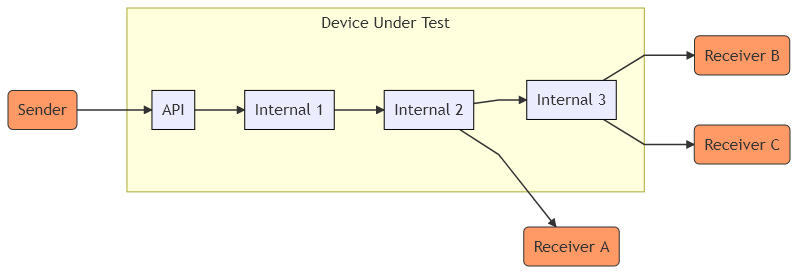

# expect-at-io

## What is this?
"expect-at-io" is a test suite for automated end-to-end integration testing. Test cases are defined from a set of
API-calls, a set of input data and the expected output data corresponding to the input.

An example system eligible for such end-to-end testing could be the one depicted in the figure below.

* `Sender` transmits a message to an `API` in order to ultimately transfer information to one or more 
receivers `Receiver A/B/C`.
* The message transmitted to `API` triggers a flow of information transferred 
between different services `Internal 1/2/3` all invisible to `Sender`.
* Ultimately, information is delivered to the receiving parts `Receiver A/B/C`. 

In order to verify that the "Device Under Test" responds as expected, one may manually perform a set of API calls with 
certain input values and manually investigate if the desired message transfers have taken place. Due to the manual 
execution of this kind of testing, it i typically very time consuming. "expect-at-io" seeks to automate this. The test 
suite runs a collection of API-calls over a set of input values and automatically verifies message transfer to the 
expected receivers.

This test suite heavily depends on the API-testing tool [Postman](https://www.postman.com/) (more specifically the 
associated command line tool [Newman](https://github.com/postmanlabs/newman)). Newman is used for 
running a collection of input API calls for testing while the graphical user interface provided by Postman is used for
specification of the API call collection.

## How to use it? (example)

### On localhost
#### Installation
* Install newman (command line tool for running postman collections)
  * [Postman Learning Center: Command line integration with Newman](https://learning.postman.com/docs/postman/collection-runs/command-line-integration-with-newman/)
  * [Newman Github repository](https://github.com/postmanlabs/newman)
* Clone the source code of `expect-at-io` from the [expect-at-io GitHub-repository](https://github.com/ulvestuen/expect-at-io) 
to your local computer.

#### Setup
From within the `src/` folder, first create a python virtual environment:
```
python3 -m venv env
```
Activate the python virtual environment:
```
source env/bin/activate
```
Install dependencies:
```
pip install -r requirements.txt
```

#### Start test framework
```
python3 application.py
```

#### Start "Device Under Test"
From within the `example/mock-wiremock/` folder, run the following script to start an example instance of wiremock:
```
./start_wiremock.sh
```
This serves as Device Under Test in this example.

#### Run test
Test cases are loaded by the following curl command:
```
curl -X POST \
  http://localhost:5000/load \
  -H 'content-type: multipart/form-data; boundary=----WebKitFormBoundary7MA4YWxkTrZu0gW' \
  -F collection=@expect-at-io-example.postman_collection.json \
  -F testdata=@input-output_data.json
```

Then run the test:
```
curl -X POST http://localhost:5000/run
```

Obtain test results:
```
curl -X GET http://localhost:5000/results
```

#### Teardown
Deactivate the virtual environment:
```
deactivate
```
Remove the virtual environment by deleting `env/` folder.


### With docker
#### Installation
* Make sure to have docker installed: [https://docs.docker.com/get-docker/](https://docs.docker.com/get-docker/)
* Clone the source code of `expect-at-io` from the [expect-at-io GitHub-repository](https://github.com/ulvestuen/expect-at-io) 
to your local computer.
* Get an `expect-at-io` docker image
  * Alternative A: Pull the latest pre-built docker container with `docker pull ulvestuen/expect-at-io`
  * Alternative B: From the `/expect-at-io` folder, run the following command to build a local docker image:
`docker build -t expect-at-io:latest .`

#### Start test framework
In this example, the test framework is started together with the test object.

#### Start "Device Under Test"
Enter the `example/mock-wiremock/` folder and run the following command to build a new docker image of the 
mock-wiremock instance:
```
docker build -t mock-wiremock:latest .
```
From the `example/` folder, start the test environment:
```
docker-compose up -d
```

#### Run test
Testcases are loaded by the following curl command:
```
curl -X POST \
  http://localhost:5000/load \
  -H 'content-type: multipart/form-data; boundary=----WebKitFormBoundary7MA4YWxkTrZu0gW' \
  -F collection=@expect-at-io-example.postman_collection.json \
  -F testdata=@input-output_data-docker.json
```

Then run the test:
```
curl -X POST http://localhost:5000/run
```

Obtain test results:
```
curl -X GET http://localhost:5000/results
```


#### Teardown
Stop 
```
docker stop expect-at-io mock-wiremock
docker rm expect-at-io mock-wiremock
docker rmi expect-at-io mock-wiremock
```
